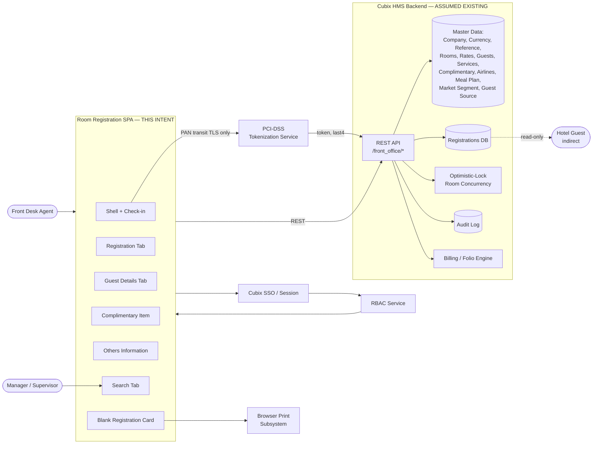

# Room Registration — System Context

## System Overview

The Room Registration module is a React 19 + Vite SPA that delivers a 6-tab wizard for checking guests into a Cubix HMS property. It runs as a sub-application under the existing Cubix HMS Front Office shell (`/front_office/new-room-registration`) and relies entirely on the existing Cubix HMS backend for master data, persistence, concurrency, PCI tokenization, authentication, and RBAC. No backend code is built in this intent.

The module produces an immutable `RR########` record per check-in, transitions room status to Occupied, opens a guest folio, posts initial charges, and writes to the audit log.

## Context Diagram

## External Integrations

- **Cubix HMS Backend REST API** (`/front_office/*`) — master data reads, registration CRUD, room concurrency, audit log writes, billing posts. Contract: **TBD — open question** (no published OpenAPI spec yet).
- **PCI-DSS Tokenization Service** — card data exchange. Integration style TBD (JS SDK vs. iframe vs. redirect). Raw PAN transits only this service; never reaches Cubix HMS storage layer in plaintext.
- **Cubix SSO / Session Middleware** — authentication. SPA consumes existing session cookie/JWT. Unauthenticated access redirects to `/login`.
- **RBAC Service** — role claims delivered via session/JWT; used for gating Blocked Guest toggle, VIP flag, Re-activate action.
- **Browser Print Subsystem** — native `Ctrl+P` for Blank Registration Card and pre-filled Registration Card (`/front_office/room-registration/pre-registration-card/{id}`).
- **Night Audit Process** (read-only dependency) — end-of-day cycle that consumes registration records. Not triggered by this module.
- **Bill Transfer / Bill Adjustment / Reservation Payment modules** (downstream) — consume folios opened by check-in. Out of scope.

## High-Level Constraints

- **Frontend-only build**: no backend code changes; all backend contracts are assumed stable. Any missing endpoint becomes an Open Question against the backend team.
- **Tech stack**: React 19 + Vite + SWC (already installed); deps already include React Query, React Router, React Hook Form, Zod, MUI, lucide-react, etc. (see `package.json`).
- **No OpenAPI spec published yet** — API contracts must be spiked or mocked; formalize during each unit's construction.
- **PCI-DSS compliance**: raw PAN never touches `localStorage`, `sessionStorage`, React state, Redux, query cache, or logs. Only tokenization-service-issued token + last-4 + expiry may be persisted.
- **RBAC enforced on backend**: UI gates are courtesy only; backend MUST re-check roles on every mutating call. Surface this expectation to the backend team.
- **Integration with existing Cubix HMS Front Office shell**: module must render inside host frame without breaking parent routing or stylesheets.
- **Property-specific branding**: Blank Registration Card hotel contact + policy clauses are currently hard-coded (BR-BRC-003, BR-BRC-004) — flagged as NFR-M-006 tech-debt.

## Key NFR Goals (guide construction)

- **Performance**: tab load < 2s; real-time interactions < 100ms; Check-in submission < 3s; Search < 3s over 10k+ records (NFR-P-001..P-016).
- **Security**: PCI-DSS tokenization mandatory; PII encrypted in transit (TLS) and masked in non-privileged views; XSS/SQLi prevention; `autocomplete="off"` on card fields (NFR-S-001..S-010).
- **Reliability**: optimistic-lock conflicts surface as actionable UX; tokenization-service outage blocks Check-in cleanly; sessionStorage survives brief network drops (NFR-R-001..R-009).
- **Usability**: WCAG AA contrast; keyboard-first tab navigation; inline validation errors; Guest Details completable in ≤3 min, Registration Tab in ≤2 min (NFR-U-001..U-015).
- **Compliance**: RFC 5321 email validation; immigration-data capture (nationality, passport, visa) for local reporting; post-check-in audit trail (NFR-C-001..C-008).
- **Maintainability**: all masters loaded dynamically (no hard-coded lists); Complimentary items honor `is_active` flag; policy clauses eventually configurable (NFR-M-001..M-009).

## Architectural Notes (frontend-only perspective)

- **State management**: single source-of-truth for the registration-in-progress, shared across all 4 wizard tabs. Candidates: Zustand (already installed) or React Context + `useReducer`. Final choice left to construction; recorded as decision in `decision-index.md`.
- **Form management**: React Hook Form + Zod (installed) for per-tab validation; cross-tab validation lives in Check-in orchestration (shell unit).
- **Data-fetching**: React Query (installed) for master data with long staleTime (masters change rarely) and short staleTime for room availability.
- **Routing**: React Router — nested routes under `/front_office/new-room-registration/*` for wizard; sibling route for Blank Registration Card.
- **UI**: MUI + custom Tailwind utilities; `lucide-react` icons; modals via MUI Dialog or headless UI patterns.
- **Testing**: Vitest + React Testing Library (configured); aim for ≥80% coverage per unit (NFR-quality gate).
