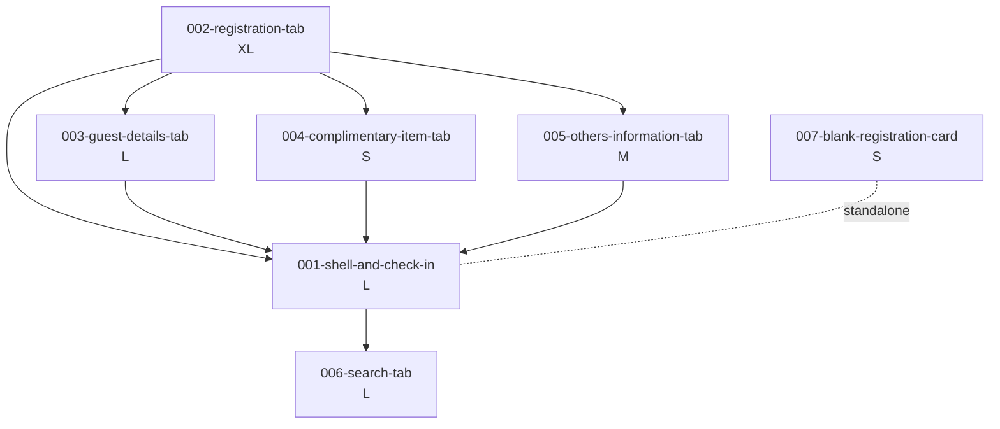

# Room Registration — Unit Decomposition

## Units Overview

This intent decomposes into **7 units**. Six map directly to BRD tabs; one (`001-shell-and-check-in`) owns the wizard shell, cross-tab validation, and the global Check-in atomic commit — all concerns that span every tab.

### Unit 001: `001-shell-and-check-in`
**Description**: Wizard shell (6-tab strip + global Check-in button), cross-tab form state, cross-tab validation, Check-in atomic-commit orchestration, RR-number surfacing, edit-mode toggle (Update Registration), session persistence, optimistic-lock handling, PCI-DSS tokenization call-site.
**Assigned FRs**: FR-001 (nav), FR-007 (Check-in)
**Deliverables**: Shell component, tab router, registration-state store (Zustand recommended), validation orchestrator, check-in service adapter, error-surfacing UX.
**Dependencies**: Depends on — all 6 tab units (reads their state). Depended by — none (terminal integration point).
**Estimated Complexity**: L

### Unit 002: `002-registration-tab`
**Description**: Tab 1. Booking context (header), room assignment, rates, discounts, services, supplemental classification, summary table.
**Assigned FRs**: FR-002, FR-003, FR-004, FR-005, FR-006
**Deliverables**: Header section component, Room List modal, RRC modal, Room form, Services form, Classification form, Summary table, currency/reference/meal-plan selects.
**Dependencies**: Depends on — none. Depended by — 001-shell-and-check-in (state consumer), 003-guest-details (adult count), 004-complimentary (package mandatory trigger).
**Estimated Complexity**: XL (highest data density; 40+ fields)

### Unit 003: `003-guest-details-tab`
**Description**: Tab 2. Per-guest profile capture — basic, contact, visa, passport, document upload. Guest search modal, Guest info modal with history. Group/family mode. Guest list table.
**Assigned FRs**: FR-008
**Deliverables**: Guest form (basic/contact/visa/passport/additional), Guest Search modal, Guest Info modal, Guest list table, document upload with progress, blocked-guest warning.
**Dependencies**: Depends on — 002-registration-tab (adult count read). Depended by — 001-shell-and-check-in (validation).
**Estimated Complexity**: L

### Unit 004: `004-complimentary-item-tab`
**Description**: Tab 3. 29-tile grid, Select All, package-mandatory lock, pre-selection from reservation.
**Assigned FRs**: FR-009
**Deliverables**: Tile grid component (responsive 4-col), Select All master, mandatory-lock handler, pre-selection adapter.
**Dependencies**: Depends on — 002-registration-tab (package/reservation context). Depended by — 001-shell-and-check-in.
**Estimated Complexity**: S

### Unit 005: `005-others-information-tab`
**Description**: Tab 4. Three sections (classification flags, departure info, credit-card guarantee). PCI-DSS tokenization integration point.
**Assigned FRs**: FR-010
**Deliverables**: Section A (classification), Section B (departure with Airlines dropdown), Section C (card form with masking + tokenization hook), mutual-exclusivity validator.
**Dependencies**: Depends on — 002-registration-tab. Depended by — 001-shell-and-check-in.
**Estimated Complexity**: M (card section is small but PCI-critical)

### Unit 006: `006-search-tab`
**Description**: Tab 5. Multi-filter search, DataTable with sort/pagination, 5 per-row actions (Edit, Re-activate, Bill Preview, Split Bill, Print). Independent of wizard state — reads registrations list.
**Assigned FRs**: FR-011, FR-012
**Deliverables**: Filter panel (11 filters), results table (9 cols + 5 actions), Re-activate confirmation dialog + RBAC, Split Bill modal, links to Bill Preview + Registration Card routes, Edit-mode entry into wizard.
**Dependencies**: Depends on — 001-shell-and-check-in (for Edit-mode entry), 002..005 (for populating wizard on Edit). Depended by — none.
**Estimated Complexity**: L

### Unit 007: `007-blank-registration-card`
**Description**: Tab 6. Static print-optimised blank pre-registration form. No DB, no interactivity. Separate route opened in new browser tab.
**Assigned FRs**: FR-013
**Deliverables**: Static component with 27 labelled fields, 14 policy clauses, consent statement, dual signature lines, print stylesheet, single-A4 layout.
**Dependencies**: Depends on — none (standalone). Depended by — none.
**Estimated Complexity**: S (mostly markup + CSS)

---

## Unit Dependency Graph

## Execution Order

Based on dependencies + complexity + risk:

1. **Wave 1 (foundation)**: `002-registration-tab` — biggest surface area, produces the registration-state shape every other tab consumes. Establishes store / form / validation patterns.
2. **Wave 2 (parallelizable)**: `003-guest-details-tab`, `004-complimentary-item-tab`, `005-others-information-tab`, `007-blank-registration-card` — independent of each other; `007` can start anytime (standalone).
3. **Wave 3 (integration)**: `001-shell-and-check-in` — must wait until all 6 tabs expose their state + validation contracts. Adds cross-tab validation, Check-in atomic-commit, RR generation, tokenization call-site.
4. **Wave 4 (independent)**: `006-search-tab` — needs Edit-mode entry (which means shell is wired), so runs after Wave 3.

### Parallelization notes
- Wave 2 units can proceed in parallel streams if there are multiple developers.
- `007-blank-registration-card` has **zero** dependencies — can ship on day 1.
- Shell unit (`001`) is pure integration — **do not** start it until tab contracts stabilize.

### Estimated timeline (single developer, reference only)
- Wave 1: ~5-7 days (Registration Tab is XL)
- Wave 2 serial: ~8-10 days (or ~3 days if fully parallelized across 4 devs)
- Wave 3: ~3-4 days
- Wave 4: ~3-4 days
- Buffer for open questions + integration issues: ~20%
- **Total**: ~4-5 weeks solo; ~2-3 weeks with parallelization

## Notes

- Cross-cutting concerns (optimistic-lock UX, PCI tokenization, RBAC gates) are implemented in the **shell unit** (`001`) — tab units emit events/state; shell orchestrates.
- Per the frontend-app preset in `catalog.yaml`: `default_bolt_type: simple-construction-bolt` (not DDD). Bolts are feature-scoped, not domain-scoped.
- Open questions flagged in `requirements.md` will be surfaced on each affected unit's `unit-brief.md` and will block the specific stories that depend on them.
